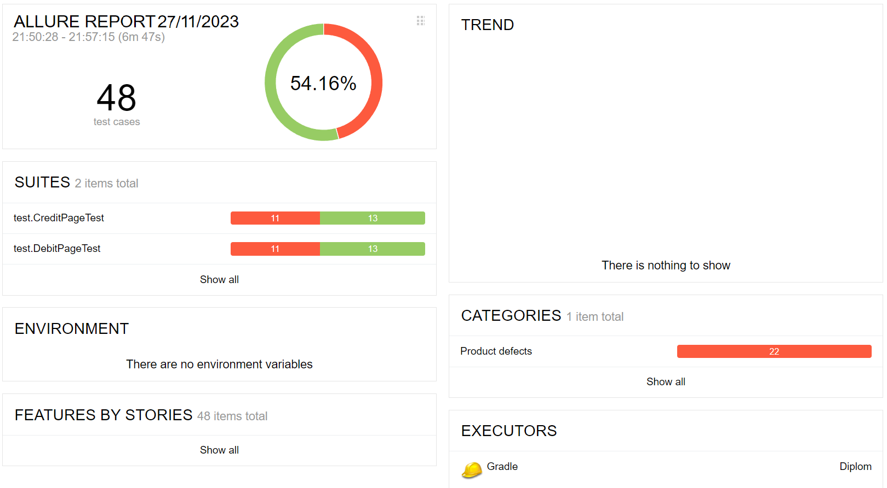

# Отчёт по итогам тестирования
### Краткое описание
Согласно тест-плану было проведено тестирование приложения: "Путешествие дня". 
Суммарное количество авто тестов - 48.
### Количество тест-кейсов
Общее количество тест-кейсов - 48:
* Покупка дебетовой картой - 24, из них:
    - позитивные - 4;
    - негативные - 20;
* Покупка в кредит - 24, из них:
    - позитивные - 4;
    - негативные - 20.

Процент тестов, завершенных успешно = 54.16%,
Процент тестов, упавших при прохождении = 45.84%.

### Общие рекомендации
1. Устранить зарепорченные в ходе тестирования ошибки
2. Подсказки об ошибках при заполнении полей формы должны быть более информативные и приведены к единому формату.